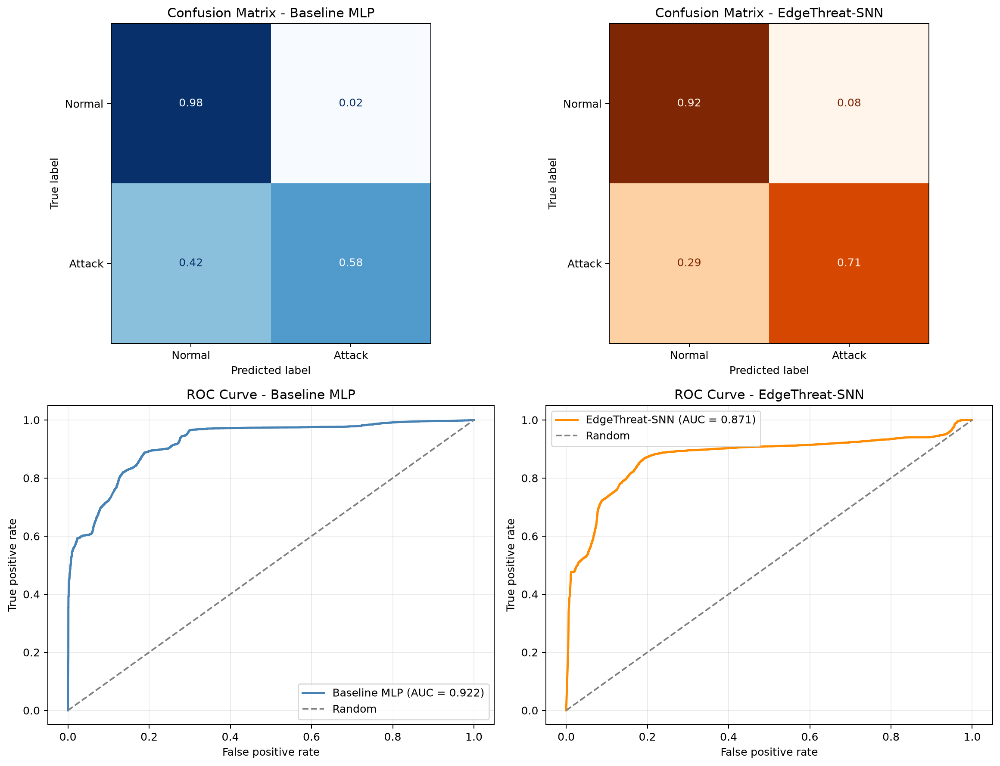

# EdgeThreat-SNN

EdgeThreat-SNN is a reproducible intrusion-detection project that compares a conventional multilayer perceptron (MLP) with a spiking neural network (SNN) on the NSL-KDD dataset.

The project evaluates both models using the same preprocessing workflow and held-out test split. It explores a practical question for edge security: can an event-driven spiking model provide useful attack-detection coverage while operating under the constraints that matter for resource-limited environments?

## Overview

Intrusion-detection systems must balance two competing goals:

- Detect as many malicious events as possible.
- Avoid excessive false alarms that create alert fatigue for security teams.

This repository implements an end-to-end experimental workflow:

1. Preprocess NSL-KDD network-connection records.
2. Train a baseline MLP classifier.
3. Train an event-driven EdgeThreat-SNN classifier using rate-encoded spike inputs.
4. Evaluate both models on the same held-out test set.
5. Save predictions, probability scores, metrics, confusion matrices, and ROC curves for reproducible comparison.

The project frames the SNN as an experimental edge-oriented intrusion detector, not as a universal replacement for conventional neural models.

## Task Definition

The current experiment uses binary intrusion detection:

| Class | Label | Meaning |
|---|---:|---|
| Normal | `0` | Benign network connection |
| Attack | `1` | Malicious or anomalous network connection |

## Dataset

This project uses the **NSL-KDD** dataset, a widely used benchmark for network intrusion-detection research.

Files used:

- `KDDTrain+.txt`
- `KDDTest+.txt`

During preprocessing, the pipeline:

- Assigns explicit NSL-KDD feature-column names.
- Removes the `difficulty` column.
- Converts the original labels into binary normal/attack labels.
- One-hot encodes categorical attributes.
- Scales numerical features.
- Saves aligned processed train and test CSV files.

> **Dataset note:** NSL-KDD is useful for controlled benchmarking, but it is a legacy dataset and does not fully represent modern enterprise, cloud, or IoT traffic. The results should therefore be interpreted as a reproducible proof of concept rather than production-readiness evidence.

## Setup

Create and activate a virtual environment, then install the project dependencies.

### Windows PowerShell

```powershell
python -m venv .venv
.\.venv\Scripts\Activate.ps1
pip install -r requirements.txt
```

### Linux / macOS

```bash
python3 -m venv .venv
source .venv/bin/activate
pip install -r requirements.txt
```

## Running the Project

Run the commands below from the repository root.

### 1. Preprocess the dataset

```powershell
python src/preprocess.py
```

### 2. Train the baseline MLP

```powershell
python src/train_baseline.py
```

### 3. Train EdgeThreat-SNN

```powershell
python src/train_snn.py
```

### 4. Evaluate both models

```powershell
python src/evaluate.py
```

This step saves metrics as well as the exact test labels, predicted classes, and predicted probabilities used for the plots.

### 5. Generate evaluation visualizations

```powershell
python src/plot_results.py
```

### 6. Generate the comparison table

```powershell
python src/comparison_table.py
```

## Output Structure

```text
data/processed/              # Processed NSL-KDD train and test CSV files
results/saved_models/        # Trained MLP and SNN model weights
results/predictions/         # Saved labels, predictions, and probability scores
results/tables/              # Evaluation metrics and comparison tables
results/figures/             # Confusion matrices and ROC curves
```

## Results

Results below were produced on the processed NSL-KDD test set.

| Model | Accuracy | Precision | Recall | F1-score | ROC-AUC | FAR | Latency (ms) |
|---|---:|---:|---:|---:|---:|---:|---:|
| Baseline MLP | 0.750 | 0.975 | 0.576 | 0.724 | 0.922 | 0.019 | 3.9 |
| EdgeThreat-SNN | 0.800 | 0.918 | 0.713 | 0.802 | 0.871 | 0.084 | 214.6 |

### Evaluation Visualizations

The following row-normalized confusion matrices and ROC curves are generated directly from the saved held-out test labels, model predictions, and probability scores.



## Interpretation

The two models make different operational trade-offs:

- **Baseline MLP:** The MLP has a higher ROC-AUC of 0.922, higher precision, and a much lower false-alarm rate of about 1.9%. It is also substantially faster in this CPU-based measurement. These properties make it the stronger choice when alert volume, inference speed, and conservative classification are priorities.

- **EdgeThreat-SNN:** The SNN achieves higher attack recall, detecting about 71.3% of attacks compared with 57.6% for the baseline. It also achieves a higher F1-score. However, it creates more false alerts, with a false-alarm rate of about 8.4%, and it is slower in the current CPU implementation.

The central result is therefore not that one model is universally better. The SNN favors broader attack detection coverage, while the MLP offers stronger ranking performance, fewer false alarms, and lower latency. A real deployment would choose between these behaviours based on the security cost of missed attacks versus unnecessary alerts.

## Reproducibility

The evaluation pipeline saves its artifacts to `results/predictions/`:

```text
y_true.npy
baseline_preds.npy
baseline_probs.npy
snn_preds.npy
snn_probs.npy
```

`src/plot_results.py` loads these files to generate the confusion matrices and ROC curves. This ensures that the visualizations are based on actual model outputs rather than manually entered summary values.

## Limitations

- The SNN is a compact prototype and has not undergone extensive architecture or hyperparameter optimization.
- The current task is binary normal-versus-attack classification rather than multiclass attack-category detection.
- Latency was measured on a local CPU environment and should not be interpreted as neuromorphic-hardware performance.
- Rate encoding and CPU-based SNN simulation introduce overhead that would differ on dedicated neuromorphic hardware.
- NSL-KDD is a benchmark dataset and does not fully reflect contemporary network traffic, adversarial behavior, or deployment conditions.
- The project analyzes structured network-connection features; it does not process event-camera or physical surveillance data.

## Future Work

- Tune the SNN architecture, threshold parameters, and number of simulation time steps.
- Compare rate encoding with latency, temporal, and population-based spike-encoding strategies.
- Extend the binary task to multiclass detection of NSL-KDD attack families, such as DoS, Probe, R2L, and U2R.
- Evaluate threshold selection using precision-recall curves and operational false-alert budgets.
- Test cross-dataset generalization on more recent intrusion-detection datasets such as UNSW-NB15, CIC-IDS2017, CIC-IDS2018, or Bot-IoT.
- Compare CPU results with deployment on dedicated edge or neuromorphic hardware.
- Add model explainability and attack-level error analysis to support security-analyst review.
- Package the inference workflow as a lightweight service or edge-agent prototype.

## Project Scope

This repository provides the complete experimental pipeline used for the reported comparison:

- Dataset preprocessing
- Baseline MLP training
- Spiking neural network training
- Shared held-out evaluation
- Metric computation
- Saved prediction artifacts
- Reproducible visualizations and comparison outputs

It is designed as a research and portfolio proof of concept for neuromorphic approaches to edge-oriented cybersecurity analytics.

## License

This project is released under the MIT License.